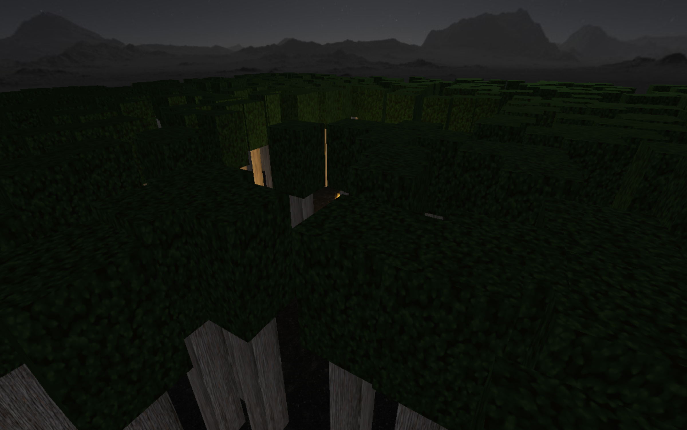

# proyecto - Bosque en la noche
## Descripción
El proyecto consiste en una escena representando un bosque durante la noche con una fogata prendida y utilizamos
el framework de javascript ThreeJS (webGL) para crearlo.

La escena la dividimos en dos tipos de formas, las primitivas simples y complejas.
Para los árboles utilizamos el cuadrado y/o rectángulo como figuras primitivas.
Para la fogata utilizamos una aplicación para modelar los objetos (rocas y troncos).

La camara de la escena puede ser controlada, pero siempre viendo hacia la fogata.

Para simular el fuego de la fogata, reutilizamos el código de volumetricFire (que pertenece a yomotsu).

La escena cuenta con 3 luces:
1. Luz de la fogata, que ilumina un área alrededor.
2. Luz general para que los objetos se muestren.
3. Luz direccional, para simular la luz de la luna en un área.

Para simular un cielo, utilizamos "SkyBox", nuestro plano dentro de él.

La escena tiene audio de fondo y el audio de la fogata es posicional, entre más te
acerques el sonido es más fuerte y viceversa.

## Capturas

## Referencias
- [ThreeJS](https://threejs.org/).
- VolumetricFire (Fogata) de [yomotsu](https://github.com/yomotsu/VolumetricFire).
- SkyBox licencia [Sleepyhollow](http://creativecommons.org/licenses/by-sa/3.0/) por:
Zachery "skiingpenguins" Slocum.

## Autores
- [@MarioMarroquin](https://github.com/MarioMarroquin)
- [@FranciscoSainz](https://github.com/pacosw1)